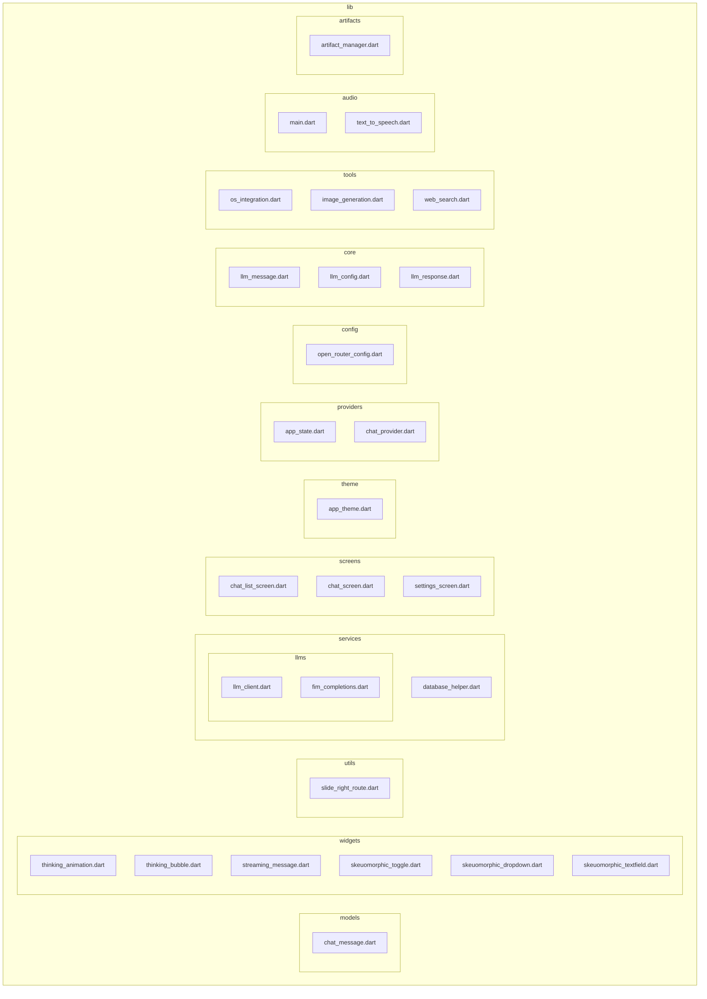
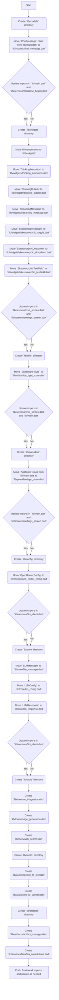

# Project Architecture Plan - generated by Roo

This document outlines the proposed architecture for the Vaarta application, incorporating the initial critique, recommendations for extensibility, and the addition of advanced features like tool calling, image generation, and voice mode.

## Initial Critique and Recommendations

The initial project structure was organized into `screens`, `services`, and `theme` directories, which is a good starting point for a Flutter project. The use of `Provider` for state management and the abstraction of database and LLM interactions were also positive aspects.

Recommendations for improvement included:

1.  Creating a `lib/models` directory for data models.
2.  Relocating UI-related classes (e.g., `ThinkingAnimation`, `ThinkingBubble`) to either `lib/screens/` (if specific to a screen) or `lib/widgets/` (if reusable).
3.  Moving the `SlideRightRoute` class to `lib/utils/`.
4.  Creating a `lib/widgets` or `lib/components` directory for reusable UI components.
5. Adding more comments.

## Extensibility and Advanced Features

To accommodate future growth and the addition of features like tool calls, image generation, FIM completion, OS integration, and voice mode, the architecture has been further refined.  The key principle is to maintain a modular design with clear separation of concerns.

The following features were considered:

*   **Tool Calls:**  Allowing the AI to interact with external tools (web search, calculations, etc.).
*   **Image Generation:**  Integrating image generation capabilities.
*   **Artifacts:**  Managing files/data generated during interactions.
*   **Fill-in-the-Middle (FIM) Completion:**  A specialized text completion mode.
*   **OS Integration:**  Interacting with the operating system.
*   **Voice-Only Mode:**  Supporting voice input and output.

## Proposed Directory Structure

```
lib/
├── models/
│   └── chat_message.dart
├── widgets/
│   ├── thinking_animation.dart
│   ├── thinking_bubble.dart
│   ├── streaming_message.dart
│   ├── skeuomorphic_toggle.dart
│   ├── skeuomorphic_dropdown.dart
│   └── skeuomorphic_textfield.dart
├── utils/
│   └── slide_right_route.dart
├── services/
│   ├── database_helper.dart
│   └── llms/
│       ├── llm_client.dart
│       └── fim_completions.dart
├── screens/
│   ├── chat_list_screen.dart
│   ├── chat_screen.dart
│   └── settings_screen.dart
├── theme/
│   └── app_theme.dart
├── providers/
│   ├── app_state.dart
│   └── chat_provider.dart  (Future)
├── config/
│    └── open_router_config.dart
├── core/
│    ├── llm_message.dart
│    ├── llm_config.dart
│    └── llm_response.dart
├── tools/
│   ├── os_integration.dart
│   ├── image_generation.dart
│   └── web_search.dart  (Example)
├── audio/
│   ├── speech_to_text.dart
│   └── text_to_speech.dart
├── artifacts/
│    └── artifact_manager.dart
└── main.dart
```

## Mermaid Diagram

Below is the Mermaid code representing the proposed directory structure.  **You will need to generate a PNG image from this code and save it as `design/architecture.png`.** You can use an online Mermaid editor (like the one at [https://mermaid.live/](https://mermaid.live/)) or a VS Code extension (like "Markdown Preview Mermaid Support") to generate the image.



## Directory/File Explanations:

*   **`lib/models/`**: Data model classes (e.g., `ChatMessage`).
*   **`lib/widgets/`**: Reusable UI components.
*   **`lib/utils/`**: Utility functions and classes.
*   **`lib/services/`**: Interactions with external services (database, LLMs).
    *   **`lib/services/llms/`**:  LLM-related logic.
        *   `llm_client.dart`: Handles communication with LLMs.
        *   `fim_completions.dart`:  Logic for Fill-In-the-Middle completions.
*   **`lib/screens/`**: UI for different app screens.
*   **`lib/theme/`**: Theme definitions.
*   **`lib/providers/`**: State management logic (using `Provider`).
*   **`lib/config/`**: Configuration classes.
* **`lib/core/`**: Core abstractions.
*   **`lib/tools/`**: Integrations with external tools.
    *   `os_integration.dart`: OS interaction.
    *   `image_generation.dart`: Image generation.
    *   `web_search.dart`: Example tool (web search).
*   **`lib/audio/`**: Voice-related functionalities.
    *   `speech_to_text.dart`: Speech-to-text conversion.
    *   `text_to_speech.dart`: Text-to-speech conversion.
* **`lib/artifacts/`**:
    *   `artifact_manager.dart`: Handles the storage, retrieval, and management of generated files or data.
*   **`lib/main.dart`**: Application entry point.
*   

- - -

The Plan I have to follow - Again by Roo

The user wants a Mermaid diagram outlining the steps to *manually* refactor their code according to the plan I've already provided. This means I need to break down the file movements and directory creations into a sequential flow.

Here's my plan:

1.  **Review Previous Plan:**  Recall the recommended changes from the architecture document.
2.  **Create Sequential Steps:**  Break down the refactoring process into a series of logical steps, suitable for manual execution.  These steps will involve:
    *   Creating new directories.
    *   Moving files to their new locations.
    *   Updating import statements in the affected files (this will be a general instruction, as I can't automatically update *all* imports).
3.  **Formulate Mermaid Diagram:**  Represent these steps in a Mermaid flowchart, using appropriate shapes for actions and decisions.
4.  **Present the Diagram to the user.**


Here's a Mermaid diagram outlining the steps for manually refactoring your code:



**Explanation of Steps:**

1.  **Start:**  Begin the refactoring process.
2.  **Create Directories:** Create the new directories: `models`, `widgets`, `utils`, `providers`,`config`, `core`, `tools`, `audio`, and `artifacts` and `services/llms`.
3.  **Move Files:** Move the specified files to their corresponding new directories.
4.  **Update Imports:**  After each file move, *carefully review and update the import statements* in any files that reference the moved file. This is crucial to avoid breaking your application.  The diagram indicates the most likely files needing import updates, but you should check all files. The decision nodes in the diagram are a simplification; you'll need to update imports *whenever* a file is moved that is imported by other files.
5. **Create `fim_completions.dart`.**
6. **Review all imports**
