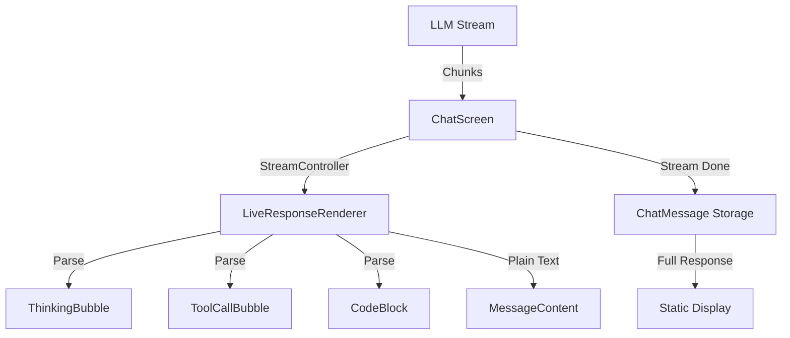

# Streaming Architecture Plan

This document outlines the plan to improve the streaming message architecture in the Vaarta app, addressing issues with data flow, naming, redundancy, and the thinking bubble, while adding support for tool calls and special tokens.

## Current State Analysis

- **Data Flow**:
  - `ChatScreen` streams AI responses via `_llmClient.streamCompletion`, appending chunks to `_streamedResponse`.
  - While streaming (`_isGenerating` is true), `_streamedResponse` is passed to `StreamingMessage`.
  - `StreamingMessage` extracts `<think>` tags into `thinkingContent` (for `ThinkingBubble`) and renders the rest as `outputContent` via Markdown.
  - Post-stream, `_streamedResponse` becomes a static `ChatMessage`, rendered as `MarkdownBody` without `StreamingMessage`.

- **Thinking Bubble Behavior**:
  - `ThinkingBubble` is a collapsible widget that displays `thinkingContent` from `StreamingMessage`.
  - It only appears in `StreamingMessage` if `<think>` tags exist. Once the stream ends, if no `<think>` tags remain, it disappears because `StreamingMessage` is replaced by `MarkdownBody`.

- **Naming Issues**:
  - `StreamingMessage` implies real-time streaming, but it's a static widget processing a single `content` string.
  - `_streamedResponse` is vague—better as `liveAssistantResponse` or similar.
  - `content`, `thinkingContent`, `outputContent` lack specificity.

- **Redundancy**:
  - `StreamingMessage` takes `theme` and `isDark` but re-fetches them from context.
  - Markdown styling is repeated across `StreamingMessage` and `_buildAssistantMessage`.

- **Extensibility**:
  - No support for "streaming tool use calls" or "special tokens" beyond `<think>`.

- **Readability**:
  - Logic is scattered: streaming in `ChatScreen`, parsing in `StreamingMessage`, display in `ThinkingBubble`.

## User Concerns

- **Unclear Data Flow**: The handoff from streaming to static display isn't visualized well.
- **Thinking Bubble Disappearing**: It's tied to `StreamingMessage`'s lifecycle.
- **Redundant Code**: Parameter and styling duplication.
- **Tool Calls & Special Tokens**: Need to support `<tool>` and `<code>` tags.

## Proposed Architecture Goals

1.  **Clear Data Flow**: Stream content incrementally, visualizing each part (thinking, tools, code, text).
2.  **Persistent Thinking Bubble**: Keep it visible post-stream if content exists.
3.  **Better Naming**: Reflect purpose (e.g., `LiveResponseRenderer`).
4.  **Remove Redundancy**: Centralize styling, remove unused parameters.
5.  **Support Tools & Tokens**: Parse `<tool>` and `<code>` with distinct UI.
6.  **Readability**: Modularize logic.

## Detailed Plan

### Step 1: Redesign `StreamingMessage`

-   Rename to `LiveResponseRenderer`.
-   Make it stateful to handle streaming updates via a `Stream<String>` or `ValueNotifier`.
-   Parse `<think>`, `<tool>`, `<code>`, and plain text into separate widgets:
    -   `ThinkingBubble` (persistent if content exists).
    -   `ToolCallBubble` (new, for `<tool>` actions).
    -   `CodeBlock` (new, for `<code>` snippets).
    -   `MessageContent` (for plain text).
-   Remove redundant `theme` and `isDark` parameters—use `Theme.of(context)`.

### Step 2: Update `ChatScreen`

-   Replace `_streamedResponse` with a `StreamController<String>` to broadcast chunks.
-   Pass the stream to `LiveResponseRenderer` during `_isGenerating`.
-   Post-stream, store the full response with parsed segments in `_messages`.

### Step 3: Enhance `ThinkingBubble`

-   Persist visibility based on content history, not just current state.

### Step 4: Create New Widgets

-   `ToolCallBubble`: Displays `<tool>` content (e.g., "Executing: search_web").
-   `CodeBlock`: Styled code display for `<code>`.

### Step 5: Data Flow Visualization

### Implementation

-   **Step 1**: Refactor `streaming_message.dart` into `live_response_renderer.dart`.
-   **Step 2**: Modify `chat_screen.dart` for stream handling.
-   **Step 3**: Update `thinking_bubble.dart`.
-   **Step 4**: Add `tool_call_bubble.dart` and `code_block.dart`.
-   **Step 5**: Switch to Code mode to implement.